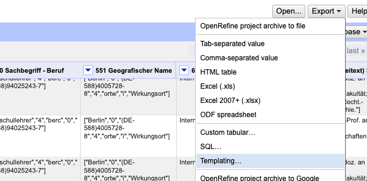
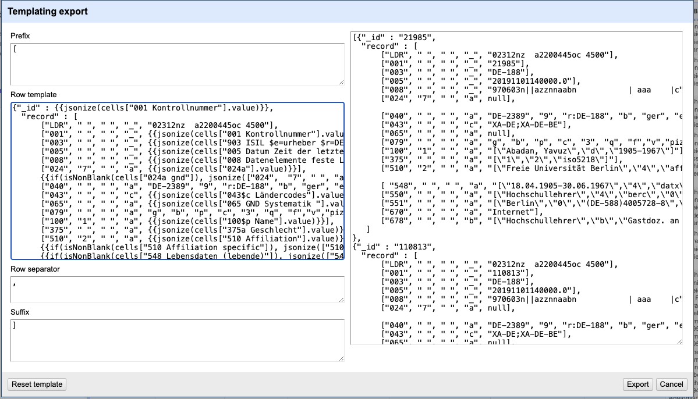

<meta name="title" 
   content="CSV zu MARC.xml">
<meta name="description" 
   content="Vorgehensweise zum Export von Personendaten (CSV) als MARC.xml">
<meta name="author"
   content="Johannes Hercher, hercher@ub.fu-berlin.de">
<meta name="tags"
   content="MARCXML; Catmandu; CSV; OpenRefine; GND">
<meta name="date"
   content="2024-06-28">


# README

In diesem Repository befindet sich eine kurze Beschreibung für die Konvertierung einer CSV mit Personendaten zu MARC.xml für den Import in die GND der Deutschen Nationalbibliothek (DNB).


## Voraussetzungen & Links
- [Catmandu](https://github.com/LibreCat/Catmandu/wiki)
- [OpenRefine](https://openrefine.org/)
- [sed](https://www.gnu.org/software/sed/manual/sed.html)
- GND-Erfassungshilfe [EH-P-16](https://wiki.dnb.de/download/attachments/90411361/EH-P-16.pdf), Pflichtfelder bei der Erfassung von Personendaten 


## Überblick

1. Personendaten in die Struktur der [Beispiel.csv](Beispiel.csv) bringen
2. Die [Beispiel.csv](Beispiel.csv) mittels Templating/Export aus Open Refine in ein [MARC-JSON (MiJ)](https://metacpan.org/pod/Catmandu::Exporter::MARC::MiJ) Format exportieren
3. Exportdatei bereinigen und die `export.json` erzeugen
4. Mit Catmandu die `export.json` in eine `export.xml` transformieren (MARC-XML) 


## (1) Vorbereitung der Personendaten als CSV

In dem angehängten CSV sind die Spalten nach den MARC-Kategorien benannt. Die Zeilen enthalten die jeweiligen Datensätze und die Zellen die MARC-Unterfelder mitsamt der Feldbelegung als 'flache' Liste. Es ist wichtig, dass diese JSON-Objekte (mit eckigen Klammern) angelegt werden, siehe Beispiel für die MARC-Kategorie 040 (Katalogisierungsquelle):

```json 

["DE-2389","b","ger","e","rda","9","r:DE-188"]

```   

Das Unterfeld $b ist im Beispiel mit der Codierung "ger" belegt, das Unterfeld $e mit der Codierung "rda". In Unterfeld $9 muss `r:DE-188` durch das Sigel der datenggebenden Institution ersetzt werden.

Hinweis: die Indikatoren und das Unterfeld $a sind zur Vereinfachung  nicht in den Zellen enthalten und werden über das Export-Template (s.u.) definiert.


## (2) Export aus OpenRefine

In OpenRefine wird ein MARC-JSON-File erstellt. Dazu wird die CSV-Datei in OpenRefine mit dem untenstehenden Template exportiert.



Die Exporteinstellungen werden wie folgt gesetzt (siehe Abb., unten).
Das Feld `Prefix`  und `Suffix`  wird mit einer öffnenden und schließenden eckigen Klammer gesetzt.
Der `Row separator` bleibt ein Komma `,`.
Im Feld `Row template` wird das untenstehende Template eingetragen.




Das Template für den Export aus OpenRefine: 

```json
{"_id" : {{jsonize(cells["001 Kontrollnummer"].value)}},
  "record" : [
      ["LDR", " ", " ", "_", "02312nz  a2200445oc 4500"],
      ["001", " ", " ", "_", {{jsonize(cells["001 Kontrollnummer"].value)}}],
      ["003", " ", " ", "_", {{jsonize(cells["903 ISIL $e=urheber $r=DE-188"].value)}}],
      ["005", " ", " ", "_", {{jsonize(cells["005 Datum Zeit der letzten Transaktion"].value)}}],
      ["008", " ", " ", "_", {{jsonize(cells["008 Datenelemente feste Länge"].value)}}],
      ["040", " ", " ", "a", {{jsonize(cells["040 Katalogisierungsquelle"].value)}}],
      ["043", " ", " ", "c", {{jsonize(cells["043$c Ländercodes"].value)}}],
      ["065", " ", " ", "a", {{jsonize(cells["065 GND Systematik "].value)}}],
      ["079", " ", " ", "a", "g", "b", "p", "c", "3", "q", "f","v","piz"],
      ["100", "1", " ", "a", {{jsonize(cells["100$p Name"].value)}}],
      ["375", " ", " ", "a", {{jsonize(cells["375a Geschlecht"].value)}}],
      ["510", "2", " ", "a", {{jsonize(cells["510 Affiliation"].value)}}],
      {{if(isNonBlank(cells["548 Lebensdaten (lebende)"]), jsonize(["548",  " ", " ", "a", cells["548 Lebensdaten (lebende)"].value] ),"")}} {{if(isNonBlank(cells["548 Lebensdaten (lebende)"]),",","")}}
      ["550", " ", " ", "a", {{jsonize(cells["550 Sachbegriff - Beruf"].value)}}],
      ["551", " ", " ", "a", {{jsonize(cells["551 Geografischer Name"].value)}}],
      ["670", " ", " ", "a", {{jsonize(cells["670 Quellenangaben"].value)}}],
      ["678", " ", " ", "b", {{jsonize(cells["678 Biogr. Angaben (Freitext) $b"].value)}}] 
   ]
}
 ```
Das Export-Template enthält die Marc-Kategorien, Indikatoren und Unterfelder. Die Kategorie `079`  wird für den Export von Personennormdaten fest codiert, weil der Inhalt zwischen den Datensätzen unverändert bleibt. 
Die restlichen Felder werden mit der jsonize-Funktion je Datensatz exportiert (`{{jsonize(cells["Spaltenname"].value)}}`). Beim Export kann auf leere Werte geprüft werden, siehe z. B. die Kategorie `548` im Export-Template.

## (3) Bereinigung der Exportdatei (TXT)
Nach dem Export erhält man eine Textdatei, z. B. `export.txt` die noch mit folgendem Befehl bereinigt werden muss.

```bash 
sed -e 's/\"\[\\\"/"/g' -e 's/\\"/"/g' -e 's/\"\]\"/"/g'  export.txt > export.json` 
```
Der sed-Befehl entfernt die eckigen Klammern und maskierte Anführungszeichen die von OpenRefine beim Export in die export.txt geschrieben werden, d. h. die Zeichenketten (`\"[\"`, `\"]\"` und `\"`) die durch einfache Anführungszeichen ersetzt werden müssen.

## (4) Transformation zu MARCXML mit Catmandu
Die erzeugte und bereinigte `export.json` kann mit Catmandu verarabeitet werden. Der zugehörige Befehl zur Erstellung der export.xml ist:

```bash 
catmandu convert JSON --type MiJ to MARC --type XML < export.json > export.xml 
``` 
